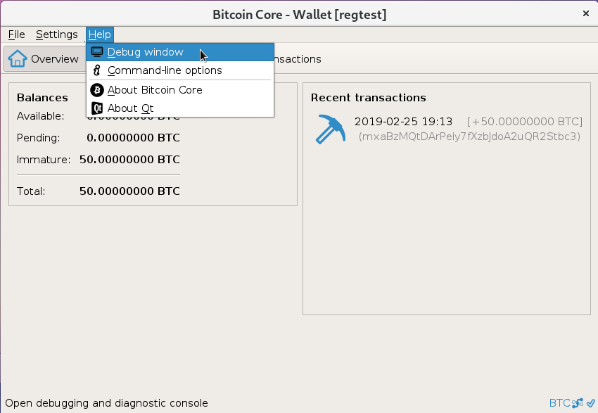
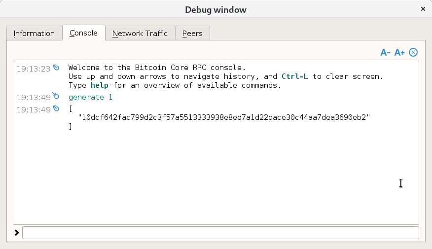
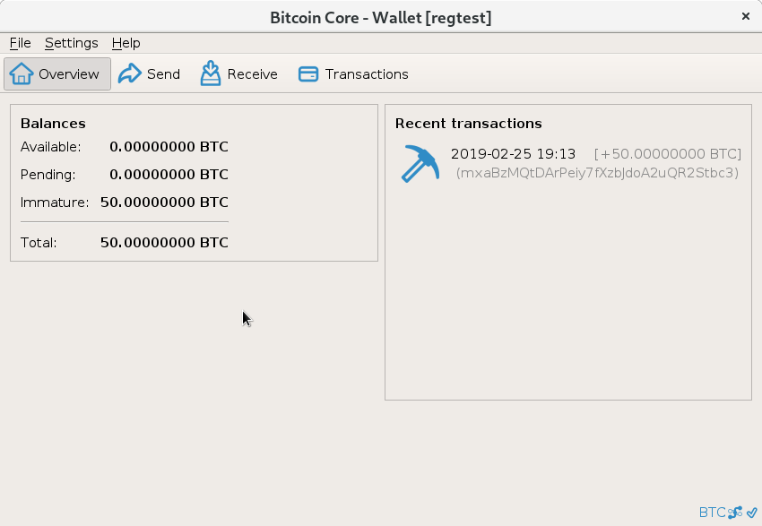
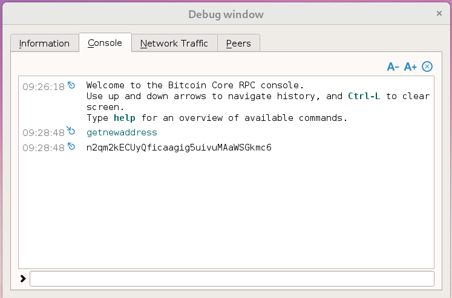
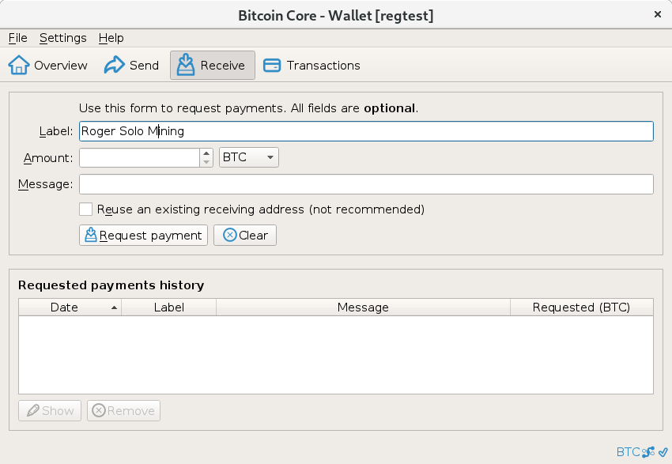
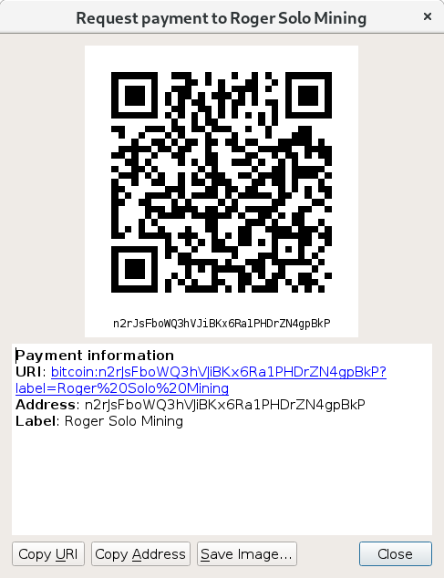

# Faire son propre réseau bitcoin avec un mining pool.
 
En utilisant les porte-feuilles déjà disponnibles sur un [RaspberryPi](https://www.raspberrypi.org/) 
et une version [Raspbian Lite](https://downloads.raspberrypi.org/raspbian_lite_latest) ,
on peut rapidement mettre en place un environnement avec les porte-feuilles graphique via le [regression-test-mode](https://bitcoin.org/en/glossary/regression-test-mode).
 À ce stade-ci, on aura en place quelques porte-feuilles
formant un pseudo réseau décentralisé à l'intérieur du Raspberry Pi. On va utiliser cgminer et valider les transactions. 
En mode régression test, la difficulté est basse et conçue pour que notre CPU puisse amplement faire le travail.

### Prérequis

*  1 Raspberry Pi et un peu d'internet pour installer des packages.
*  1 mineur (dans mon cas via une clef USB Icarius 333mh/s)
*  1 mining pool (facultatif)

### Installation du porte-feuille

Installer le porte-feuille graphique et aussi celui en texte afin d'avoir accès a la commande bitcoin-ctl
qui est l'équivalent de la console de debugging mais en ligne de commande shell.

~~~
sudo apt install bitcoin-qt bitcoind cgminer
~~~

### Création de l'environnement pour les porte-feuilles

Avec cela on obtiendra quatre porte-feuilles pour faire nos tests. Il en faut minimalement deux pour créer un réseau. Le script 
va créer quatre porte-feuilles, Alice et Bob, car en cryptographie c'est toujours eux. Ensuite, un pour le setup du mining pool et 
un dernier pour Roger, le mineur. Finalement un petit script pour démarrer les porte-feuilles et créer automatiquement un 
fichier texte contenant une adresse de réception pour ce dernier.

##### Créer l'environment et les bitcoin.conf dans /home/pi/btc

~~~
cd /home/pi
mkdir -p btc/{alice,bob,pool,roger}
cd btc

cat <<EOF > alice/bitcoin.conf
regtest=1            
server=1                    
listen=1                
connect=127.0.0.1:18334                          
connect=127.0.0.1:18335 
connect=127.0.0.1:18336
datadir=/home/pi/btc/alice/               
port=18333                                    
rpcport=31443                           
rpcuser=alice                               
rpcpassword=a11ce                               
EOF

cat <<EOF > bob/bitcoin.conf
regtest=1                                
server=1                                 
listen=1                                     
connect=127.0.0.1:18333                   
connect=127.0.0.1:18335                       
connect=127.0.0.1:18336                                  
datadir=/home/pi/btc/bob/
port=18334
rpcport=31444
rpcuser=bob
rpcpassword=B0B
EOF

cat <<EOF > pool/bitcoin.conf
regtest=1
server=1
listen=1
connect=127.0.0.1:18333
connect=127.0.0.1:18334
connect=127.0.0.1:18336
datadir=/home/pi/btc/pool/
port=18335
rpcport=31445
rpcuser=pool
rpcpassword=loop
EOF

cat <<EOF > roger/bitcoin.conf
regtest=1
server=1
listen=1
connect=127.0.0.1:18333
connect=127.0.0.1:18334
connect=127.0.0.1:18335
datadir=/home/pi/btc/roger/
port=18336
rpcport=31446
rpcuser=roger
rpcpassword=soleil
EOF
~~~

##### Un script pour démarrer les wallet

~~~
cat <<EOF > start-all-wallets.sh
#!/bin/bash

echo "Alice"
bitcoin-qt -conf=/home/pi/btc/alice/bitcoin.conf -datadir=/home/pi/btc/alice/ &
sleep 10
if [ -e "wallet-alice.txt" ]
then
    echo "Alice's wallet exist"
else
     bitcoin-cli -conf=/home/pi/btc/alice/bitcoin.conf -datadir=/home/pi/btc/alice/ getnewaddress > wallet-alice.txt
fi

echo "Bob"
bitcoin-qt -conf=/home/pi/btc/bob/bitcoin.conf -datadir=/home/pi/btc/bob/ &
sleep 10
if [ -e "wallet-bob.txt" ]
then
    echo "Bob's wallet exist"
else
     bitcoin-cli -conf=/home/pi/btc/bob/bitcoin.conf -datadir=/home/pi/btc/bob/ getnewaddress > wallet-bob.txt
fi

echo "Roger"
bitcoin-qt -conf=/home/pi/btc/roger/bitcoin.conf -datadir=/home/pi/btc/roger/ &
sleep 10
if [ -e "wallet-roger.txt" ]
then
    echo "Bob's wallet exist"
else
     bitcoin-cli -conf=/home/pi/btc/roger/bitcoin.conf -datadir=/home/pi/btc/roger/ getnewaddress > wallet-roger.txt
fi

echo "Pool"
bitcoind -conf=/home/pi/btc/pool/bitcoin.conf -datadir=/home/pi/btc/pool/ -daemon
sleep 10
if [ -e "wallet-pool.txt" ]
then
    echo "Bob's wallet exist"
else
     bitcoin-cli -conf=/home/pi/btc/pool/bitcoin.conf -datadir=/home/pi/btc/pool/ getnewaddress > wallet-pool.txt
fi

EOF
~~~

### Démarrer la blockchain.

Si les quatre porte-feuilles ont bien démarré et que l'image était bleue, on peut poursuivre. Il ne reste qu'a miner le 
[genesis block](https://en.bitcoin.it/wiki/Genesis_block). Pour réaliser cela, il suffit d'ouvrir la console et 
d'y saisir ***generate 1***. Voilà le premier block est miné. 

Si on veut le générer, on peut le faire via la ligne de commande aussi.

~~~
bitcoin-cli -conf=/home/pi/btc/alice/bitcoin.conf -datadir=/home/pi/btc/alice/ generate 1
~~~
 
Malgré tout, il reste 100 confirmations avant que les fonds soient disponibles. La commande generate 
permet de miner un certain nombre de blocs rapidement. C'est rapide si on veut jouer avec les porte-feuilles
et tester différentes opérations.

*  transaction 1 - 1
*  transaction 1 - many
*  sign messages

### Configurer un mineur.

Le mining est le processus du type [Proof of Work](https://en.wikipedia.org/wiki/Proof-of-work_system) de validation 
utilisé pour sécuriser un block et celle de tout le reste de la blockchain. L'action de miner ou de
sécuriser un block résulte en la création de 50 bitcoins déposés directement dans le porte-feuille du mineur. Ensuite 
au fil du temps soit tout les 210000 blocs cette redevance se voit drastiquement coupée en deux, d'ou le terme 
[halving]().
Cette technique de solo-mining existe encore aujourd'hui.

Donc, notre ami Roger, le mineur décide de se lancer. Il ouvre son wallet, il doit se générer une adresse pour recevoir 
ses redevances minières. Pour cela, il a deux options.
 
##### Ouvrir la console et saisir ***getnewaddress***.

##### Faire une requête de paiement avec un label optionnel.

Une fenetre de confirmation s'affiche et l'adresse est utilisable pour recevoir des paiements.

##### En shell 
~~~
bitcoin-cli -conf=/home/pi/btc/alice/bitcoin.conf -datadir=/home/pi/btc/alice/ getnewaddress
~~~

Bref, plusieurs moyens sont possibles, l'important est d'en avoir une provenant du porte-feuille de Roger.
Dans le fichier wallet-roger.txt on devrait en avoir une fraichement générée à ce stade-ci. Poursuivons avec
le paramétrage du mineur, ***cgminer*** dans notre cas. 

##### Afficher les paramètres RPC du wallet

~~~
cat roger/bitcoin.conf |grep rpc
~~~

Observons la configuration du porte-feuille car le solo mining se fait par une connexion à un porte-feuille via le protocole RPC.

~~~
rpcport=31446
rpcuser=roger
rpcpassword=soleil
~~~

##### Construisons notre commande pour cgminer

~~~
cgminer --url http://127.0.0.1:31446 --btc-address $(cat wallet-roger.txt) -O roger:soleil -T
~~~

Voilà la blockchain en place et un réel mineur valide des transactions. On peut s'ammuser avec des projets 
comme [celui-ci](https://github.com/philipperemy/my-first-bitcoin-miner) pour pousser l'audace juste qu'a 
comprendre la structure d'un block et la mécanique reliée au mining.

### Installer et configurer un mining pool

De nos jours on fait appel a des mining-pool car notre puissance de mining est très faible par rapport à l'ensemble 
de la puissance déployé sur l'entierté du réseau. Donc si on veut s'assurer récolter une certaine quantité de revenus 
à interal régulier, on a nul autre choix que de faire confience à un mining-pool.  

Pour le modèle actuel avec les mining-pools, j'ai débuté avec [ckpool](https://bitbucket.org/ckolivas/ckpool-splns/) 
mais rapidement j'ai eu des problèmes avec les paramètres reliés a la difficulté. Le pool refusais systématiquement les 
shares. Bref avec un peu de recherches je suis arrivé sur [Nomp](https://github.com/zone117x/node-open-mining-portal). 
Il semble très polivalant et overkill comparativement au premier. 

L'installation est relativement simple malgré tout. Coté configuration, si on déactive la majorité des fonctionnalités 
dont on a pas besoin pour explorer la technologie, on se rend compte que la configuration repose en quelque éléments 
a modifier dans 2 fichiers .json.

##### Installer les outils de compilation et libraries

~~~
sudo apt install build-essential libtool autotools-dev autoconf pkg-config libssl-dev
sudo apt install libboost-all-dev git npm nodejs libminiupnpc-dev redis-server
sudo apt install libdb-dev libdb++-dev
~~~

##### Install nvm
~~~
git clone https://github.com/creationix/nvm.git ~/.nvm
sudo echo "source ~/.nvm/nvm.sh" >> ~/.bashrc && sudo echo "source ~/.nvm/nvm.sh" >> ~/.profile
source ~/.bashrc
~~~

##### Installer le mining-pool nomp

FIXME: problème nvm/npm installé un peu tout croche
~~~
cd /home/pi/btc
git clone https://github.com/zone117x/node-open-mining-portal nomp
cd nomp
nvm install 0.10.25
sudo npm install node-gyp rebuild
sudo npm install stratum-pool
#npm update
sudo /home/pi/.nvm/v0.10.25/bin/node /home/pi/.nvm/v0.10.25/bin/npm update
~~~

Dans config.json on déactive le site web ainsi que les fonction de gestion pour les workers. 

~~~
    "defaultPoolConfigs": {
        "blockRefreshInterval": 1000,
        "jobRebroadcastTimeout": 55,
        "connectionTimeout": 600,
        "emitInvalidBlockHashes": false,
        "validateWorkerUsername": false,   <----
        "tcpProxyProtocol": false,
        "banning": {
            "enabled": false,  <----

...

    "website": { 
        "enabled": false,   <----

...
~~~

##### Un diff du fichier example et de notre configuration.
~~~
pi@raspberrypi:~/btc/nomp $ diff config_example.json config.json 
17c17
<         "validateWorkerUsername": true,
---
>         "validateWorkerUsername": false,
20c20
<             "enabled": true,
---
>             "enabled": false,
33c33
<         "enabled": true,
---
>         "enabled": false,
~~~

*  coins/bitcoin.json

Ce fichier devrait déjà être paramétré.

~~~
{
    "name": "Bitcoin",
    "symbol": "BTC",
    "algorithm": "sha256"
}
~~~

*  pool_config/bitcoin.json

Ici on doit paramétrer l'adresse de roger et du gestionnaire du mining pool.

~~~
{
    "enabled": true,
    "coin": "bitcoin.json",

    "address": "n4jSe18kZMCdGcZqaYprShXW6EH1wivUK1",    <---- wallet-pool.txt

    "rewardRecipients": {
        "n37vuNFkXfk15uFnGoVyHZ6PYQxppD3QqK": 1.5,      <---- wallet-bob.txt ( bob étant le pool manager )
        "22851477d63a085dbc2398c8430af1c09e7343f6": 0.1 
    },

    "paymentProcessing": {
        "enabled": true,
        "paymentInterval": 20,
        "minimumPayment": 70,
        "daemon": {
            "host": "127.0.0.1",
            "port": 31445,             <---- $(cat pool/bitcoin.conf |grep rpcport |cut -d\= -f2)
            "user": "pool",            <---- $(cat pool/bitcoin.conf |grep rpcuser |cut -d\= -f2) 
            "password": "loop"         <---- $(cat pool/bitcoin.conf |grep rpcpassword |cut -d\= -f2)
        }
    },

    "ports": {
        "3008": {
            "diff": 8
        },
        "3032": {
            "diff": 32,
            "varDiff": {
                "minDiff": 8,
                "maxDiff": 512,
                "targetTime": 15,
                "retargetTime": 90,
                "variancePercent": 30
            }
        },
        "3256": {
            "diff": 256
        }
    },

    "daemons": [
        {
            "host": "127.0.0.1",
            "port": 31445,             <---- $(cat pool/bitcoin.conf |grep rpcport |cut -d\= -f2)
            "user": "pool",            <---- $(cat pool/bitcoin.conf |grep rpcuser |cut -d\= -f2) 
            "password": "loop"         <---- $(cat pool/bitcoin.conf |grep rpcpassword |cut -d\= -f2)
        }
        {
            "host": "127.0.0.1",
            "port": 31443,             <---- $(cat alice/bitcoin.conf |grep rpcport |cut -d\= -f2)
            "user": "alice",           <---- $(cat alice/bitcoin.conf |grep rpcuser |cut -d\= -f2)
            "password": "a11ce"        <---- $(cat alice/bitcoin.conf |grep rpcpassword |cut -d\= -f2)
        }
    ],

    "p2p": {
        "enabled": false,     <---- changer de true à false
        "host": "127.0.0.1",
        "port": 31443,
        "disableTransactions": true
    },

    "mposMode": {
        "enabled": false,
        "host": "127.0.0.1",
        "port": 3306,
        "user": "me",
        "password": "mypass",
        "database": "ltc",
        "checkPassword": true,
        "autoCreateWorker": false
    }

}
~~~

##### Partir le mining-pool

~~~
node init.js
~~~

##### Commande cgminer via notre mining-pool

~~~
cgminer --url stratum+tcp://127.0.0.1:3008 -u $(cat wallet-roger.txt) -p x -T --verbose
~~~

observer les wallet de roger et du pool.
