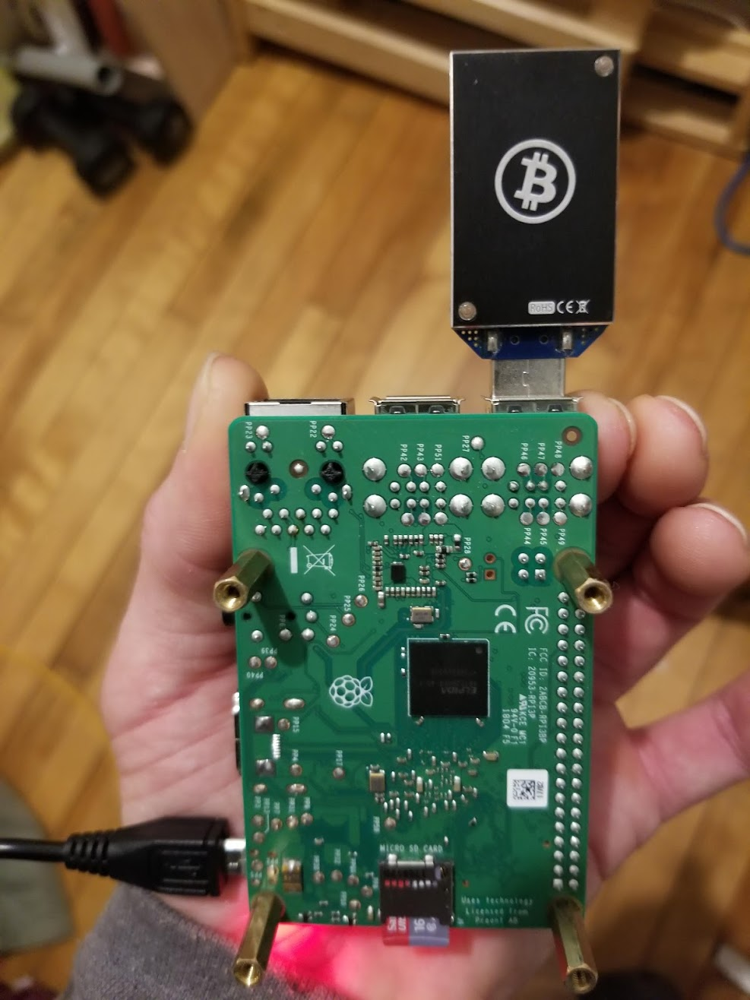
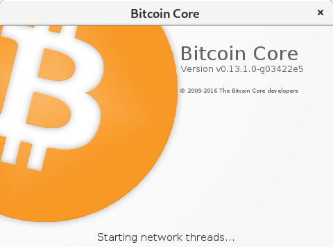
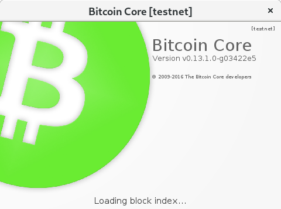
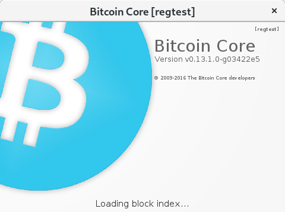

# Introduction

Étant intéressé au mining depuis 2013, j'ai lu beaucoup sur le sujet sans vraiment prendre le temps de m'y plonger. Cette fois-ci,
j'ai pris le temps de le faire et de documenter un peu l'expérience afin que d'autres puissent en bénificier. 
Vous verrez certainement des similarités avec d'autres documents comme celui-ci déjà en ligne depuis très longtemps. 
Je n'invente rien, j'explore seulement la technologie BlockChain et je prends des notes afin de partager mon expérience.

Je crois qu'il y a rien de mieux que de se faire un petit laboratoire pour explorer le [Bitcoin](https://www.bitcoin.org/).

Afin de mieux comprendre le fonctionnement des blockchains et de ses éléments clefs, j'ai premièrement relu le
[whitepaper](https://bitcoin.org/bitcoin.pdf) ainsi que ses références à [B-money](http://www.weidai.com/bmoney.txt) 
et [hashcash](http://www.hashcash.org/papers/hashcash.pdf).  
 
Ensuite je voulais bien comprendre le processus et les étapes que Satoshi Nakamoto a dû effectuer afin de signer le premier bloc. 

Avant de poursuivre, portez attention à la couleur du logo et la barre de titre car cela nous indique visuellement
sur quel réseau on est connecté. 

Dans notre cas, on veut le mode Bleu!

*  [mainnet](https://bitcoin.org/en/glossary/mainnet)

*  [testnet](https://bitcoin.org/en/glossary/testnet)

*  [regtest](https://bitcoin.org/en/glossary/regression-test-mode)

Avec les étapes ci-bas, on va premièrement se créer un réseau bitcoin personnel avec tout ce qui faut pour miner et faire
miner nos CPU ou vieux ASIC format clef USB sur un mining pool. 
 
Ensuite, on va se familiariser avec le processus de recompilation du porte-feuile pour ultimement modifier le code source et 
y inclure la signature de notre propre bloc [Genesis Block](https://en.bitcoin.it/wiki/Genesis_block).

On va aussi prendre le temps de faire toutes les étapes nécéssaires pour miner le 1er block et le signer avec une clé privée spécifique.

Voyons oul'exploration nous mènera.

# Mes Documents d'exploration
 
*  [Créer son propre réseau bitcoin avec un mining pool](Installer-bitcoind-regtest.md)

